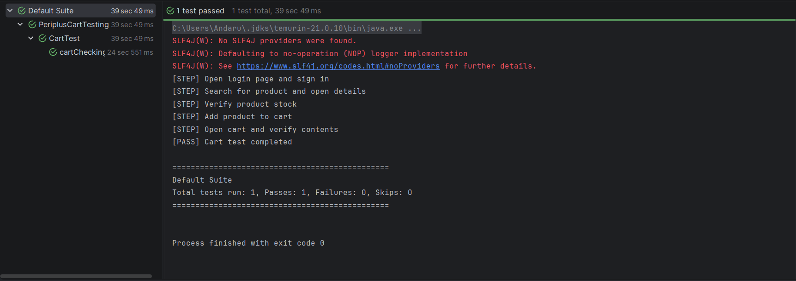

PeriplusCartTesting
====================

Repository: https://github.com/AndaruHP/PeriplusCartTesting

Purpose
-------
This repository contains a small automated test suite for the Periplus website focused on cart-related flows (search, add to cart, view cart).

Test Case
---------
| No | Component | Description                                                                                                                                                                                                                                                                                                                                                       |
| --- | --- |-------------------------------------------------------------------------------------------------------------------------------------------------------------------------------------------------------------------------------------------------------------------------------------------------------------------------------------------------------------------|
| 1 | Test Case ID | TC-001                                                                                                                                                                                                                                                                                                                                                            |
| 2 | Description | Verify that a user can successfully add a product to the shopping cart.                                                                                                                                                                                                                                                                                           |
| 3 | Module | Shopping Cart                                                                                                                                                                                                                                                                                                                                                     |
| 4 | Pre-conditions | 1. User has a registered account on Periplus.com<br/>2. The shopping cart is empty                                                                                                                                                                                                                                                                                |
| 5 | Test Steps | 1. Open https://periplus.com<br/>2. Log in with valid credentials<br/>3. Type the product name in the search bar (e.g., "How to Win Friends and Influence People")<br/>4. Click the search button<br/>5. Select the first product from the search results<br/>6. Enter the quantity<br/>7. Click the "ADD TO CART" button<br/>8. Click the "SHOPPING CART" button |
| 6 | Test Data | - Email: andaruandaru1904@gmail.com<br/>- Password: PeriplusAccount2026<br/>- Search keyword: How to Win Friends and Influence People<br/>- Quantity: 1                                                                                                                                                                                                           |
| 7 | Expected Result | The book is added to the cart, and the cart page shows quantity 1 for the selected book.                                                                                                                                                                                                                                                                          |
| 8 | Actual Result | Matches expected result, the selected book appears in the cart with quantity 1.                                                                                                                                                                                                                                                                                   |
| 9 | Post-conditions | The cart contains the selected product with quantity 1.                                                                                                                                                                                                                                                                                                           |
| 10 | Status | Pass                                                                                                                                                                                                                                                                                                                                                              |
| 11 | Priority | High                                                                                                                                                                                                                                                                                                                                                              |
| 12 | Tester / Date | Andaru Hymawan / 17 May 2026 |

Test Run Log
------------


How to Run
----------
Run the full TestNG suite:

```powershell
mvn test
```

Run with custom data using system properties:

```powershell
mvn -Dperiplus.user="you@example.com" -Dperiplus.password="SecretPwd" -Dperiplus.search="Some Book" test
```

Test Data
---------
Values are loaded in this order: system properties, environment variables, then defaults (see `TestConfig`).

- `periplus.user` / `PERIPLUS_USER`
- `periplus.password` / `PERIPLUS_PASSWORD`
- `periplus.search` / `PERIPLUS_SEARCH`

Optional: copy `.env.example` to `.env` and load it with your shell or CI tool before running tests.

Project Structure
-----------------
- `src/main/java/com/periplus/pages` — Page Object classes
- `src/test/java/com/periplus/base` — Base test setup and config
- `src/test/java/com/periplus/test` — Test classes
- `testng.xml` — TestNG suite definition
